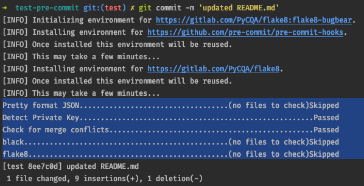

# test-pre-commit

## Getting Started

How to use `pre-commit`:
1. Install app using brew
    - `brew install pre-commit`
2. Once installed pre-commit need to be installed in the repo. This is simply done by typing
    - `pre-commit install`
3. The first commit after installing will apply all the hooks defined in `.pre-commit-config.yaml` and run them
    